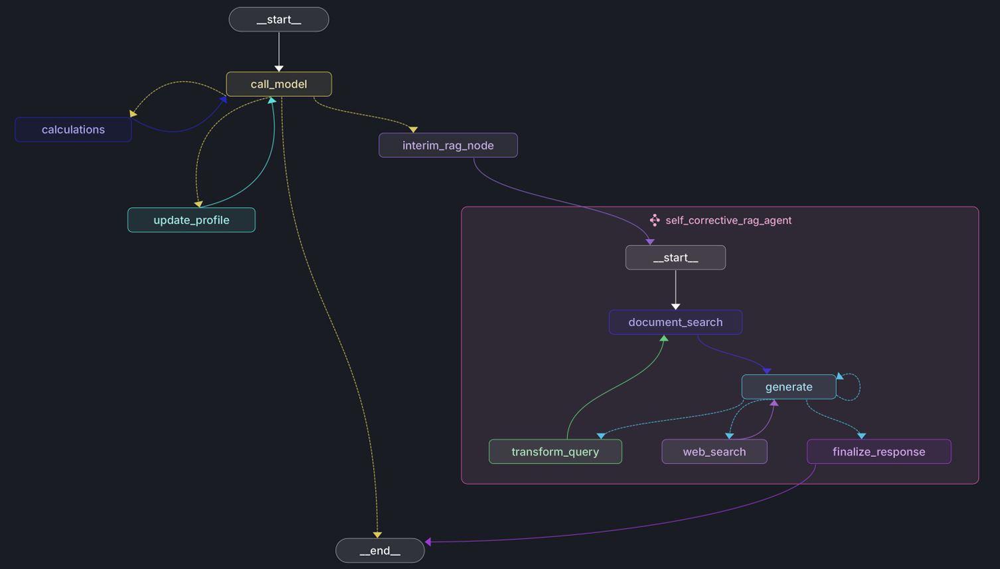

# 🧠 Multi-Agent System with Long-Term User Memory & Self-Corrective RAG


This repository contains a modular, extensible multi-agent system featuring:

* 📊 Arithmetic and scientific calculators
* 🧠 Long-term memory with profile extraction and update
* 🔁 A **Self-Corrective RAG Agent** for document-based Q\&A with hallucination detection and retry mechanisms
* 🌐 Web fallback for unanswered queries
* 🔗 Persistent memory using PostgreSQL


This system is designed for integration into an online course or educational platform, where it acts as a smart learning assistant. By building a structured long-term memory of each user’s academic background, interests, and goals, it delivers personalized support throughout their learning journey. The multi-agent architecture includes specialized tools for handling arithmetic calculations and a self-corrective RAG (Retrieval-Augmented Generation) agent that retrieves, verifies, and refines answers to study-related questions. This ensures learners receive accurate, context-aware responses tailored to their needs.

---
## Agent in action

* Self-Corrective_RAG sub-graph in action: https://youtu.be/9tdjUe1EOGM
* (Web-Fallback) Self-Corrective_RAG sub-graph in action: https://youtu.be/Z460EwiRhe8
* Long-Term User Memory module in action: https://youtu.be/lDHMzpfKkjI
* Calculators node in action: https://youtu.be/ZLCACAmxWRE 
---



---

## 🚀 Overview

This project is a highly capable intelligent agent system designed to reason, calculate, learn from interactions, and provide accurate answers through an advanced **retrieval-augmented generation (RAG)** pipeline.

It consists of several key components:

### 🧮 1. **Calculation Tools**

* Supports arithmetic operations using dedicated subagents.
* Validates results to ensure accuracy.

### 🧠 2. **Long-Term Memory**

* Captures, stores, and updates structured user profile data across sessions.
* Example memory schema:

```python
class Profile(BaseModel):
    """Represents structured user profile information."""
    name:        Optional[str]  = Field(description="User's name",                                              default=None)
    bachelor:    Optional[str]  = Field(description="Bachelor's degree subject(s)",                             default=None)
    master:      Optional[str]  = Field(description="Master's degree subject(s)",                               default=None)
    phd:         Optional[str]  = Field(description="PhD subject(s)",                                           default=None)
    connections: list[str]      = Field(description="User's personal connections (friends, family, coworkers)", default_factory=list)
    interests:   list[str]      = Field(description="User's interests",                                         default_factory=list)
```

Stored using a combination of:

* 🗃️ In-memory store (for session-based reasoning)
* 🐘 PostgreSQL (for persistent cross-session memory)

### 📚 3. **Self-Corrective RAG Agent**

A subgraph agent responsible for:

1. Retrieving relevant documents
2. Generating an answer
3. Checking for hallucinations
4. If hallucinated:

   * Attempts regeneration or query reformulation (up to a configurable retry limit)
   * Falls back to web search if needed

---

## 🛠️ Setup & Installation

### 1. Clone the repo

```bash
git clone https://github.com/your-org/multi-agent-system.git
cd multi-agent-system
```

### 2. Install dependencies

```bash
pip install -r requirements.txt
```

Make sure you have:

* Python 3.11+
* PostgreSQL running and accessible
* Environment variables set (e.g. OpenAI API keys, etc.)

---

## ⚙️ Usage

The main entry point is the compiled graph:

```python
config = {"configurable": {"thread_id": "1", "user_id": "1"}}

# User input to create a profile memory
input_messages = [HumanMessage(content="Hi my name is Lance.")]

# Run the graph
for chunk in graph.stream({"messages": input_messages}, config, stream_mode="values"):
    chunk["messages"][-1].pretty_print()

```

### Configurable parameters:

* `user_id`: used to isolate memory and personalize responses
* `retries`: max attempts for the RAG agent
* `web_fallback`: toggle fallback behavior

---

## 🧪 Features In Depth

### 🔁 Self-Corrective RAG Flow

1. Retrieve documents
2. Generate candidate answer
3. Validate for hallucination
4. Retry / reformulate
5. Fallback to web search
6. Return the final answer

### 📥 TrustCall-Based Profile Learning

Automatically extracts and stores:

* Academic history
* Interests
* Social graph

---

## 🧪 Example Use Cases

* Conversational tutoring agent with memory
* Personal knowledge assistant
* Domain-specific customer support
* Adaptive recommendation systems

---

## 🧱 Tech Stack

* 🐍 Python
* 🧠 OpenAI GPT (via `langchain_openai`)
* 🛠️ LangGraph & LangChain
* 📦 Pydantic
* 🐘 PostgreSQL
* 🔎 TrustCall Extractor

---

## 📌 Roadmap


* [ ] GUI interface with streamlit or FastAPI
* [ ] Additional calculator tools (e.g., statistics, matrix math)
* [ ] Real-time memory editing via API

---

## 🤝 Contributing

Pull requests are welcome! For major changes, please open an issue first to discuss what you’d like to change.

---

## 📄 License

[MIT License](./LICENSE)

---

## 🧑‍💻 Maintainers

* **\[Ans IMRAN]**
